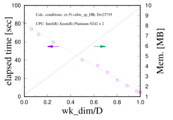

# Performance: Dependence of Computational Time on `wk_dim`

## Overview

One distinctive feature of **QS³‑ED2** is the ability to **cache Hamiltonian matrix elements in memory**.
This functionality was not present in the original QS³‑ED implementation. By storing matrix elements
within the available memory, repeated evaluations of the Hamiltonian action can be avoided, which can
significantly accelerate the Lanczos iterations.

In conventional exact diagonalization implementations, the action of the Hamiltonian on a basis state

$$
\hat H |a\rangle
$$

is recomputed every time it is required. In QS³‑ED2, however, matrix elements can optionally be
**cached and reused**, reducing the computational overhead of repeated Hamiltonian applications.

To illustrate the effect of this design, we investigate how the **computation time depends on the
parameter `wk_dim`**, which controls how many Hamiltonian matrix elements are stored in memory.

The benchmark is performed using the calculation conditions of **Example 9 (`cubic_sp_HB`)**, except
that the calculation of local magnetization and correlation functions is disabled.

---

# Benchmark model

The `cubic_sp_HB` example corresponds to an **antiferromagnetic Heisenberg model** on a cubic lattice
of size

$$
10 \times 10 \times 10
$$

with periodic boundary conditions.

The Hamiltonian is

$$
\hat H =
\sum_{\langle r,r'\rangle}
\mathbf{S}_r \cdot \mathbf{S}_{r'} .
$$

The calculation is performed in a symmetry sector defined by the following quantum numbers.

## Magnetization sector

The total magnetization is fixed to

$$
S^z = M_s - N_{\downarrow},
$$

where

$$
M_s = \frac{N}{2}
$$

is the **saturation magnetization** of a spin‑1/2 system with \(N\) sites, and

$$
N_{\downarrow}
$$

denotes the number of down spins.

In this benchmark

$$
N_{\downarrow} = 3 .
$$

The dimension of the Hilbert space in this magnetization sector is therefore

$$
\binom{N}{N_{\downarrow}}
=
\binom{1000}{3}
=
166{,}167{,}000 .
$$

## Momentum sector

The calculation is performed at the Γ point

$$
\mathbf{k} = (0,0,0).
$$

## Reflection symmetries

The state belongs to the **even‑parity sector** with respect to reflections about the

- XY plane
- YZ plane
- ZX plane

which corresponds to the input condition

```
M1 = M2 = M3 = M4 = M5 = M6 = 0
```

After applying all translational and reflection symmetries, the working Hilbert space becomes

$$
D = 23{,}719 ,
$$

corresponding to a reduction of approximately

$$
\sim 1/7000
$$

compared with the original Hilbert space.

---

# Optimal value of MNTE

Before tuning `wk_dim`, an appropriate value of **MNTE** must be specified.

`MNTE` represents the maximum number of Hamiltonian matrix elements generated when the Hamiltonian
acts on a single representative state.

For the present model it is straightforward to determine that

```
MNTE = 19
```

is optimal.

This can be understood by considering a configuration in which the

$$
N_{\downarrow} = 3
$$

down spins are well separated.

When the Hamiltonian acts once,

- each spin can hop to its nearest neighbors
- the cubic lattice has coordination number

$$
z = 6 .
$$

Therefore the number of off‑diagonal transitions is

$$
z \times N_{\downarrow} = 6 \times 3 = 18 .
$$

In addition, the Hamiltonian contains the diagonal interaction term

$$
\hat S^z_r \hat S^z_{r'} .
$$

Thus the total number of generated matrix elements becomes

$$
MNTE = z N_{\downarrow} + 1 = 19 .
$$

---

# Computational cost with and without caching

Let

```
NO_one + NO_two ~ O(N)
```

denote the cost of applying the Hamiltonian once to a representative state.

The computational cost of evaluating

$$
\hat H |a\rangle
$$

depends on whether the matrix elements are cached.

### With matrix‑element caching

$$
O(N)
$$

### Without caching

$$
O\!\left(
N
\times
\left(\prod_{m=1}^{6} L_m \right)
\times
N_{\downarrow}
\times
\log(N_{\downarrow})
\right)
$$

The additional cost arises because, after generating a new configuration, the program must determine
**which representative state the configuration belongs to** under the symmetry group.

This requires an additional search over the symmetry operations, producing the factor

$$
\left(\prod_{m=1}^{6} L_m \right)
\times
N_{\downarrow}
\times
\log(N_{\downarrow}).
$$

Therefore, **when sufficient memory is available, caching matrix elements is strongly recommended.**

---

# Cost of each computational stage

The computational complexity of the main stages of the calculation can be roughly estimated as follows.

## Selection of representative states

$$
O\!\left(
D \times N^2 \times N_{\downarrow} \times \log(N_{\downarrow})
\right)
$$

## Matrix‑element storage

$$
O\!\left(
wk\_dim \times N \times N_{\downarrow} \times \log(N_{\downarrow})
\right)
$$

## Lanczos iterations

$$
O\!\left(
N_{itr}
\left[
wk\_dim +
(D-wk\_dim)
N \times N_{\downarrow} \times \log(N_{\downarrow})
\right]
\right)
$$

where

$$
N_{itr} \sim O(10\text{–}100)
$$

is the number of Lanczos iterations.

Since

$$
\prod_{m=1}^{6} L_m \sim O(N)
$$

and

$$
D \sim O\!\left(\frac{\binom{N}{N_{\downarrow}}}{N}\right),
$$

the dominant computational cost becomes

### Case 1: `wk_dim = 0`

$$
O\!\left(
N_{itr} \times D \times N^2 \times N_{\downarrow} \times \log(N_{\downarrow})
\right)
$$

### Case 2: `wk_dim = D`

$$
O\!\left(
D \times N^2 \times N_{\downarrow} \times \log(N_{\downarrow})
+
N_{itr} \times N \times D
\right)
$$

---

# Expected speedup

The ratio between these two limits is approximately

$$
R =
O\!\left(
N_{itr}^{-1}
+
(N \times N_{\downarrow} \times \log N_{\downarrow})^{-1}
\right).
$$

For typical QS³ calculations the first term dominates, leading to a theoretical speedup of roughly

$$
\sim O(N_{itr})
$$

which corresponds to **up to about two orders of magnitude**.

---

# Benchmark result

The measured dependence of the runtime on

```
wk_dim / D
```

is shown in the figure below.

{ width="650" }

The computation time decreases approximately **linearly** as a function of

$$
wk\_dim / D .
$$

For the present benchmark

- the runtime is reduced by approximately **17×**
- the required memory increases by approximately **8×**

This clearly demonstrates the effectiveness of the matrix‑element caching mechanism.

---

# Practical recommendation

When sufficient memory is available, increasing `wk_dim` is an effective strategy for accelerating the
Lanczos iterations.

However, caution is required for models **without U(1) symmetry**, since

- the value of `MNTE` typically becomes larger
- the memory consumption grows significantly

and the caching strategy may become memory‑limited.
